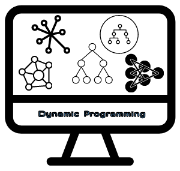

<p align="center">
  <a href="" rel="noopener">
 </a>
</p>

<div align="center">

  
 
[](/LICENSE)

</div>

---
### 📝 Table of Contents
- [🧐 About <a name = "about"></a>](#-about-)
- [🚀 Getting Started <a name = "getting_started"></a>](#-getting-started-)
  - [Prerequisites](#prerequisites)
- [👨‍🚀 Author](#-author)
- [🎉 Acknowledgements <a name = "acknowledgement"></a>](#-acknowledgements-)

## 🧐 About <a name = "about"></a>

This is the result of the [Free 5-hours Dynamic Programming course on Youtube](https://youtu.be/oBt53YbR9Kk) from the excellent [freeCodeCamp](https://freecodecamp.org) material that I took in order to sharpen my skills to solve algorithmic problems and coding challenges. I did improve my understanding about node trees and now I know more usage cases for recursion and memoization and am able to make complex code much more efficient.
Great content, you should check it out too!

## 🚀 Getting Started <a name = "getting_started"></a>

At your terminal, enter the project directory and just run each code file individually like this:

```
node name_of_file.js
```

### Prerequisites

If you don't have nodeJS installed yet, [download and install from here](https://nodejs.org/en/)

## 👨‍🚀 Author
| [](https://trepichio.github.io) |
|:--------------------------------------------------:|
| [João Trepichio](https://trepichio.github.io)    |
| [🔥 GitHub](https://github.com/trepichio)


## 🎉 Acknowledgements <a name = "acknowledgement"></a>

- References:
  - [freeCodeCamp website](https://freecodecamp.org)
  - [Free 5-hours Dynamic Programming course on Youtube ](https://youtu.be/oBt53YbR9Kk)
  - [NodeJS](https://nodejs.org/en/)
  - [MDN Javascript](https://developer.mozilla.org/en-US/docs/Web/JavaScript)
